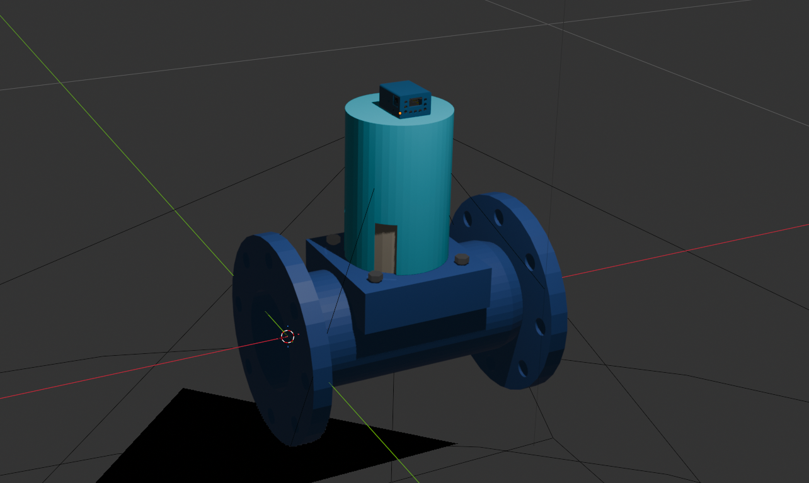
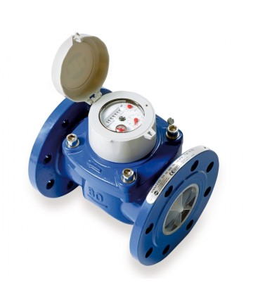
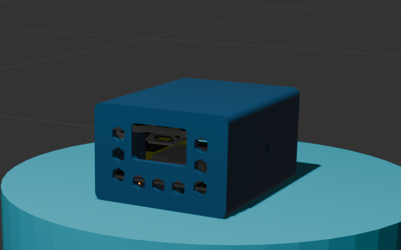

# 🧊 3D Phisical Mount (Blender)

This directory includes the source 3D model for the water meter phisical support along with the ESP32-CAM MB case, created entirely in **Blender** (`.blend` format).

### 🎯 Designed for WMAP EVO DN100
The support provided in the project is specifically designed to fit the **wmap_evo_dn100** water meter. The dimensions and mounting mechanism have been adjusted for this specific dial face to ensure perfect alignment for the camera.

  

### 📦 Integrated ESP32-CAM MB Case
The 3D model features an attached housing designed to securely hold the **ESP32-CAM MB**. This keeps the ESP32 fixed in its position, and makes the entire setup compact and sturdy.

  

### ♻️ Reusable & Customizable
Even if you don't have a WMAP EVO DN100, this Blender project is built to be a universal starting point. It is highly adaptable and can be easily modified to fit almost any other water, gas, or electricity meter.
